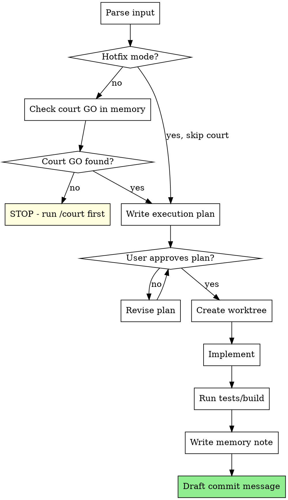

# Implement - Build With Memory

Execute planned work inside a worktree, with a pre-approval gate and full memory tracking.

## Input

- `/implement [feature-name]` - Standard mode. Reads court decision + plan from memory.
- `/implement --hotfix [description]` - Fast-track. Skips court requirement. Logs bypass to memory.

## Flow



## Step 0: Record Base SHA

Before any changes, capture the current HEAD:

```bash
git rev-parse HEAD
# Store this as base_sha - critique will diff against it
```

## Step 1: Context Loading

Read from basic-memory (project: vault):

```
# Standard mode - read court decision
basic-memory > search > query: "forge/decisions/[feature-name]", project: "vault"
```

**About /plan:** `/plan` is Claude Code's native planning mode, not a forge skill. Use it with `writing-plans` constraints before calling `/implement`. There is no plan note in memory. The plan lives in the conversation context or in a committed `docs/plans/` file.

For `--hotfix`: skip court check. If no court decision exists, proceed directly with execution plan.

## Step 2: Execution Plan

Before touching any code, write an execution plan and present to user:

```markdown
## Execution Plan: [feature-name]

**Court decision:** [link to decision note or "HOTFIX - bypassed"]
**Plan reference:** [link to plan note or "N/A"]

### Changes
1. [file/path] - [what changes and why]
2. [file/path] - [what changes and why]
3. ...

### New files
- [file/path] - [purpose]

### Tests
- [what will be tested]
- [test commands to run]

### Risk
- [anything that could go wrong]
```

**Wait for user approval before proceeding.**

## Step 3: Implementation

- Use worktree isolation for feature work (not for hotfixes)
- Follow existing project conventions (check CLAUDE.md, coding-standards)
- Run tests and build after implementation:

```bash
# Project-specific - detect and run
npm run build / npm run test / pytest / python manage.py test
```

If tests fail: fix before continuing. Do not write memory note for broken code.

## Step 4: Memory Note

Write to basic-memory after successful implementation:

```
basic-memory > write_note > project: "vault"
```

Note identifier: `[feature-name]_implement` (this is what `/critique` searches for).

Write with: `basic-memory > write_note > title: "[feature-name] Implementation", directory: "forge/active", project: "vault"`

Note format:

```markdown
---
title: [feature-name] Implementation
category: forge/active
status: IMPLEMENTING
date: YYYY-MM-DD
court_decision: [link or "HOTFIX"]
base_sha: [SHA captured in Step 0, before changes]
head_sha: [current HEAD sha, after changes]
---

# [feature-name] Implementation

## What was done
- [concrete change 1]
- [concrete change 2]

## Files changed
- `path/to/file.py` - [what changed]
- `path/to/component.tsx` - [what changed]

## Decisions made during implementation
- [any deviation from plan and why]

## Tests
- [test results summary]
- [commands run]

## Ready for critique
- [ ] Tests pass
- [ ] Build succeeds
- [ ] No lint errors
- [ ] Self-review done (re-read changed files)
```

## Step 5: Commit Message Draft

Suggest a commit message based on changes:

```
feat([scope]): [what and why in one line]

[optional body with context]
```

Do not commit automatically. Present the draft and let user decide.

## Hotfix Protocol

When `--hotfix` is used:

1. Skip court check
2. Write `court_decision: HOTFIX` in memory note
3. Add `hotfix_reason: [user's description]` to frontmatter
4. Still write execution plan (can be shorter)
5. Still run tests
6. Still write memory note
7. `/retro` will flag hotfixes that should have gone through court

## Common Mistakes

| Mistake | Fix |
|---|---|
| Starting to code before user approves execution plan | Always wait for explicit approval |
| Not running tests | Tests are mandatory, not optional |
| Writing memory note for broken code | Fix first, then write note |
| Hotfixing what should be a feature | If it touches architecture or adds new patterns, it needs court |
| Forgetting git SHA | Always capture base_sha (before) and head_sha (after) in memory note |
