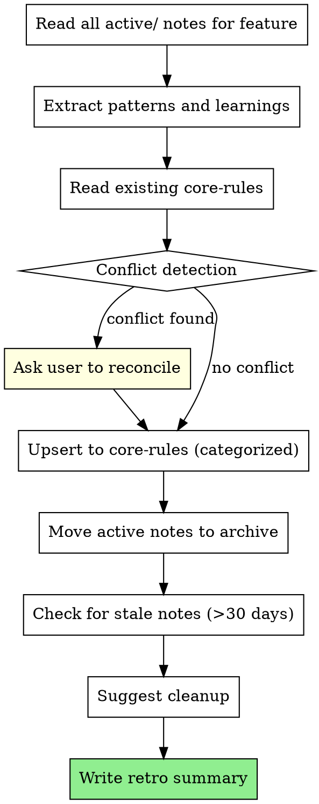

# Retro - Consolidate and Prune

Extract durable patterns from completed work, archive stale notes, and keep core-rules clean.

## Input

- `/retro [feature-name]` - Retro for a specific feature
- `/retro` - Retro for all completed features in `active/`

## Flow



## Step 1: Read Active Notes

Gather all notes related to the feature:

```
basic-memory > search > query: "forge/active/[feature-name]", project: "vault"
```

This includes:
- `[feature]_implement.md` - what was built, files changed
- `[feature]_critique.md` - findings, verdict, pre-mortem scenarios

Also read the court decision:
```
basic-memory > search > query: "forge/decisions/[feature-name]", project: "vault"
```

## Step 2: Extract Patterns

From the implement + critique cycle, identify:

1. **What worked** - Patterns that led to clean implementation or PASS verdict
2. **What broke** - Issues found by critique that should be caught earlier next time
3. **What was learned** - New knowledge about the stack, libraries, or domain
4. **Hotfix audit** - If implementation was `--hotfix`, should it have gone through court?

Format extractions as rules:

```markdown
## Rule: [concise name]
**Context:** [when this applies]
**Pattern:** [what to do]
**Learned from:** [feature-name, date]
**Replaces:** [old rule if updating, or "new"]
```

## Step 3: Read and Compare Core Rules

Read existing core-rules files:

```
basic-memory > read_note > identifier: "forge/core-rules/react", project: "vault"
basic-memory > read_note > identifier: "forge/core-rules/django", project: "vault"
basic-memory > read_note > identifier: "forge/core-rules/postgres", project: "vault"
basic-memory > read_note > identifier: "forge/core-rules/workflow", project: "vault"
```

For each extracted pattern:
1. Check if a similar rule already exists
2. If exists and agrees: skip (no duplicate)
3. If exists and contradicts: **CONFLICT** - present both to user

### Conflict Resolution

When a new pattern contradicts an existing rule:

```markdown
## CONFLICT DETECTED

**Existing rule:** [rule from core-rules]
**New pattern:** [pattern from this retro]
**Feature context:** [where new pattern was learned]

Options:
A) Keep existing rule (new pattern was context-specific)
B) Replace with new rule (existing rule is outdated)
C) Scope both: "[rule A] when [context A], [rule B] when [context B]"
```

Wait for user decision. Do not auto-resolve conflicts.

## Step 4: Upsert to Core Rules

Write patterns to the appropriate file based on category:

| Pattern about | File |
|---|---|
| React components, hooks, state, rendering | `forge/core-rules/react.md` |
| Django views, ORM, models, migrations | `forge/core-rules/django.md` |
| PostgreSQL queries, indexes, schema | `forge/core-rules/postgres.md` |
| Process, workflow, tooling, patterns | `forge/core-rules/workflow.md` |

**Upsert, not append.** Read the file, find the right section, insert the rule in logical order. If updating an existing rule, replace it and add `Updated: YYYY-MM-DD` to the rule.

Core-rules files use this structure:

```markdown
---
title: [Stack] Core Rules
category: forge/core-rules
last_updated: YYYY-MM-DD
---

# [Stack] Core Rules

## ORM / Queries
- [rule 1]
- [rule 2]

## Views / API
- [rule 1]

## Testing
- [rule 1]
```

## Step 5: Archive

Move completed feature notes from `active/` to `archive/`:

```
# Move the note
basic-memory > move_note > identifier: "[note]", destination: "forge/archive", project: "vault"

# Update status in frontmatter
basic-memory > edit_note > identifier: "[note]", operation: "find_replace", find_text: "status: IMPLEMENTING", content: "status: ARCHIVED", project: "vault"
basic-memory > edit_note > identifier: "[note]", operation: "find_replace", find_text: "status: PASS", content: "status: ARCHIVED", project: "vault"
```

Note: `move_note` does not update frontmatter. Use a separate `edit_note` call to set `status: ARCHIVED`.

## Step 6: Stale Note Cleanup

Check for notes in `active/` older than 30 days:

```
basic-memory > search > query: "forge/active/", project: "vault"
```

For each stale note, present to user:

```markdown
## Stale Notes Found

| Note | Date | Age | Action? |
|---|---|---|---|
| feature-x_implement | [date from frontmatter] | [days since date] | Archive / Keep / Delete |
| feature-y_critique | [date from frontmatter] | [days since date] | Archive / Keep / Delete |
```

Wait for user decision on each.

## Step 7: Retro Summary

Write summary to memory and print to terminal:

```markdown
---
title: [feature-name] Retro
category: forge/archive
status: ARCHIVED
date: YYYY-MM-DD
---

# [feature-name] Retro

## Timeline
- Court: YYYY-MM-DD [GO]
- Implement: YYYY-MM-DD
- Critique: YYYY-MM-DD [PASS/REJECTED x N attempts]
- Retro: YYYY-MM-DD

## Patterns Extracted
- [rule 1] -> core-rules/[file].md
- [rule 2] -> core-rules/[file].md

## Conflicts Resolved
- [conflict and resolution, or "None"]

## Hotfix Audit
- [was hotfix justified? or "N/A"]

## Notes Archived
- [list of archived notes]

## Stale Notes Cleaned
- [list of cleaned notes, or "None found"]
```

## Common Mistakes

| Mistake | Fix |
|---|---|
| Appending rules without reading existing | Always read core-rules first, upsert not append |
| Auto-resolving conflicts | Always ask user |
| Extracting too many rules from one feature | 1-3 rules per feature is healthy. More = over-generalizing. |
| Deleting active notes without archiving | Archive first, user can delete from archive later |
| Skipping hotfix audit | Every hotfix should be questioned: was court needed? |
